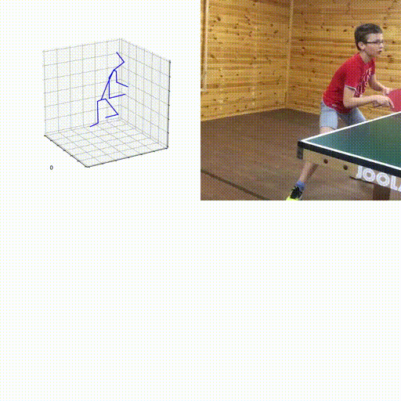

# sports_pose_scripts

## Pose estimation with motionBERT

This is a pet project for 3D pose recovery given a 2D video applied in table tennis teaching.

Compare student's pose with a teacher's pose.

Core pose recovery processes come from motionBERT and Alphapose.

## Demo

Input video: https://www.youtube.com/watch?v=Ex5E1iLzsSw

Output: 



(Hit moment is automatically detected based on speed of hand motion.)

## Installation

### Conda Environment

1. Install Anaconda

2. Create conda environment using the provided environment file:
```
conda env create -f environment.yml
```

3. Get motionBERT and Alphapose from their repositories.

## Folder Structure

Follow the directory hierarchy below for organizing your project files:
```
- sports_pose_scripts
- motionBERT
-- ...
- AlphaPose
-- ...
- projects
-- [project_name]
--- dataset
---- table_tennis.mp4
```
## Running the project
Navigate to the **sports_pose_scripts** folder in your terminal

Run the following command to execute the project:
```
python run.py project_name
```
